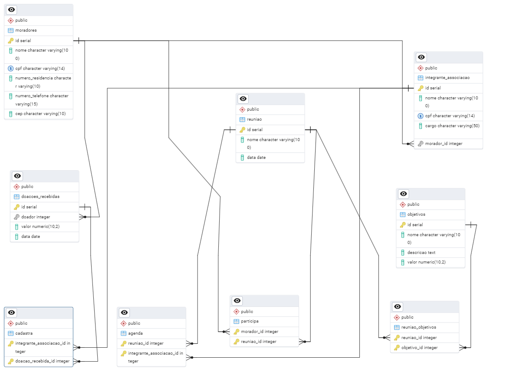

## Arquivos para o Trabalho de Extensão de Banco de Dados

#### Conteúdo do repositório: 

Todas as queries SQL utilizadas para fazer o trabalho de extensão de Banco de Dados e documentação para que qualquer pessoa consiga fazer manipulações de CRUD (CREATE, READ, UPDATE, DELETE) ou (CRIAÇÃO, LEITURA, ATUALIZAÇÃO, REMOÇÃO) básicas utilizando códigos pré-definidos.

 

## Informações

- O código utilizado na criação das tabelas pode ser encontrado no arquivo DB.SQL

- Enquanto a manipulação dos dados de relacionados a cada tabela estará disponível no arquivo CRUD.SQL

- Abaixo estará disponível o DER gerado a partir do pgAdmin4
 

